  

<h3 align="center">
  🔴 Databricks-inspired Data Engineer | ❄️ Snowflake Builder | ☁️ AWS Certified | 🤖 AI Engineer
</h3>

  

  
  

  
  
  
  

---

<table>
  <tr>
    <td width="58%">
      <h2>💫 About Me</h2>
      
I build modern data platforms that move from raw ingestion to clean, trusted, analytics-ready data.

      <ul>
        <li>🔥 <b>3.6+ years</b> of Data Engineering experience</li>
        <li>🔥 Designing scalable <b>ETL and ELT pipelines</b></li>
        <li>🔥 Processing <b>TB-scale datasets</b> with PySpark and Databricks</li>
        <li>🔥 Building AWS-native data workflows and automation</li>
        <li>🔥 Working across Snowflake, Airflow, Terraform, SQL, and Data Warehousing</li>
        <li>🔥 Exploring <b>Generative AI, RAG, Agentic AI, and LLM apps</b></li>
        <li>🔥 Iterating every day: learn, build, measure, optimize, repeat</li>
      </ul>
    </td>
    <td width="42%" align="center">
      
    </td>
  </tr>
</table>

---

## ⚡ Tech Stack

### 🔴 Data Engineering Core

### ☁️ Cloud, DevOps, and Warehousing

### 💻 Programming and Querying

### 🤖 AI and GenAI

---

## 🧱 Data Platform Flow

```mermaid
flowchart LR
    A["Raw Data"] --> B["AWS S3 / Landing Zone"]
    B --> C["Glue / PySpark"]
    C --> D["Databricks Lakehouse"]
    D --> E["Snowflake Warehouse"]
    E --> F["Analytics and AI Apps"]

    style A fill:#0B0F19,stroke:#FF3621,color:#FFFFFF
    style B fill:#101826,stroke:#FF9900,color:#FFFFFF
    style C fill:#101826,stroke:#FF3621,color:#FFFFFF
    style D fill:#FF3621,stroke:#FFFFFF,color:#FFFFFF
    style E fill:#29B5E8,stroke:#FFFFFF,color:#0B0F19
    style F fill:#8A2BE2,stroke:#FFFFFF,color:#FFFFFF
```

---

## 🏆 Certifications

| Cloud and Data | AI and Developer |
| --- | --- |
| 🏅 AWS Certified Cloud Practitioner | 🏅 Generative AI |
| 🏅 Databricks Certified Associate | 🏅 Generative AI Powered Coding Assistance |
| 🏅 GitHub Foundations | 🏅 Continuous Learning |

---

## 📈 Career Highlights

- ✨ Built ETL pipelines processing TB-scale datasets
- ✨ Developed enterprise-grade PySpark and Databricks solutions
- ✨ Improved AWS Glue job performance by **20%**
- ✨ Implemented Data Lake and Data Warehouse architectures
- ✨ Automated AWS workflows using Lambda and SNS
- ✨ Integrated Snowflake, Iceberg, MySQL, and AWS ecosystems

---

## 🔁 Iterative Engineering Mindset

---

## 📊 GitHub Analytics

  
  

  

---

## 🎯 2026 Goals

| Goal | Focus |
| --- | --- |
| ✅ Master Advanced Data Engineering | Scalable pipelines, optimization, lakehouse patterns |
| ✅ Build End-to-End AI Applications | RAG, LLM apps, agentic workflows |
| ✅ Contribute to Open Source | Data and AI ecosystem |
| ✅ Achieve Advanced Cloud Certifications | AWS, Databricks, Snowflake |
| ✅ Become a Data and AI Platform Architect | Architecture, reliability, business impact |

---

  

  <b>⭐ If you like my work, feel free to star my repositories and connect with me!</b>

